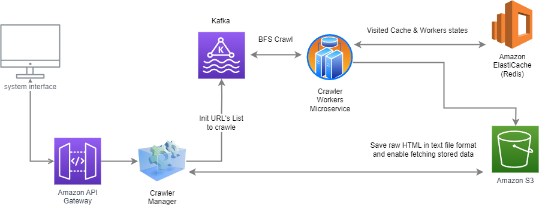

Yonatan Gazit "URL Explorer System" - README

System Architecture:
--------------------

The "URL Explorer System" is a distributed web scraping backend system that can collect unique URLs
and their corresponding HTML content. It consists of several components working together:

1. Kafka: A message broker used for communication between the web scraper and the consumers.
The producer sends URLs to be scraped, and the consumers process the URLs and send newly discovered URLs back to the producer for further scraping.

2. Redis: A key-value store used to keep track of visited URLs. 
It helps prevent duplicate scraping and enforces the maximum number of URLs and the maximum time limit.

3. Web Scraper: The main component responsible for scraping web pages.
It uses BeautifulSoup for parsing HTML, saving each URL and its corresponding raw HTML into .txt files.

4. S3 (Simple Storage Service) for saving the results files

5. FastAPI: The web framework used for exposing API endpoints to start the scraping process and interact with the Web Scraper.

Algorithm - Recursive BFS of Discovered URLs:
-----------------------------------------------
The web scraper uses a Recursive Breadth-First Search (BFS) algorithm to discover and scrape URLs from web pages. The process is as follows:

1. Start with a list of initial URLs the user provides in the API request.

2. For each URL in the list, the system starts a scraping process.

3. When processing a URL, the scraper fetches the web page, extracts the raw HTML content, and saves it to a .txt file.

4. The scraper parses the HTML using BeautifulSoup to find all anchor (a) tags containing href attributes.

5. For each discovered URL (href), the scraper adds it to the Kafka queue to be processed in the future.
This recursive process allows the scraper to traverse the web in a breadth-first manner, scraping new URLs as they are discovered.

6. Because it's a recursive algorithm, stop points was added and can be changed based on the system's needs.
The algorithm will stop based on three scenarios:
a. max_depth
b. max_urls
c. max_time_in_sec

Database Schema:
----------------
Because raw HTML is a semi-structured data format with no limited size, data is stored in a .txt file.
A corresponding file will emerge named {ASCII(URL)} in lowercase for each URL.
Inside the files, the first row will be the 'raw URL' and the second row will contain the 'raw HTML'.

API Endpoints:
--------------
In your browser, go to: "http://127.0.0.1:8000/docs" to connect to the FastAPI.

1. GET /: Description: The root endpoint welcomes users to the Web Scraper API.
Response: {"Hello": "Welcome to the Web Scraper API!"}

2. POST /scrape/: Description: Initiates the web scraping process with the provided initial URLs and parameters.
Request Body: { "initial_urls": List[str]: The list of initial URLs to start scraping from.
Response: {"message": "Scraping completed!"}

3. GET /file_list/: Description: Retrieve a list of stored files in the S3 bucket.
Response: Returns a list of file names available in the S3 bucket.

4. GET /file_list/{file_name}: Description: Retrieve the stored file content from the S3 bucket for a specific file name.
Response: Returns a JSON object with the 'raw_url' and 'raw_html' for the requested file.

Please note that before running the Web Scraper, make sure to have Kafka and Redis up and running (use docker-compose.yml file if needed)
and configure the necessary connection details in the code.

For any questions or issues, don't hesitate to get in touch with jonatangazit@gmail.com